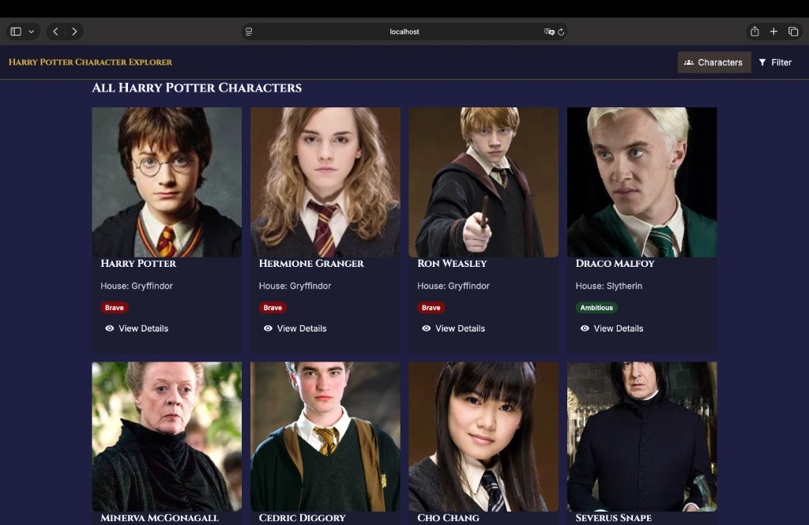
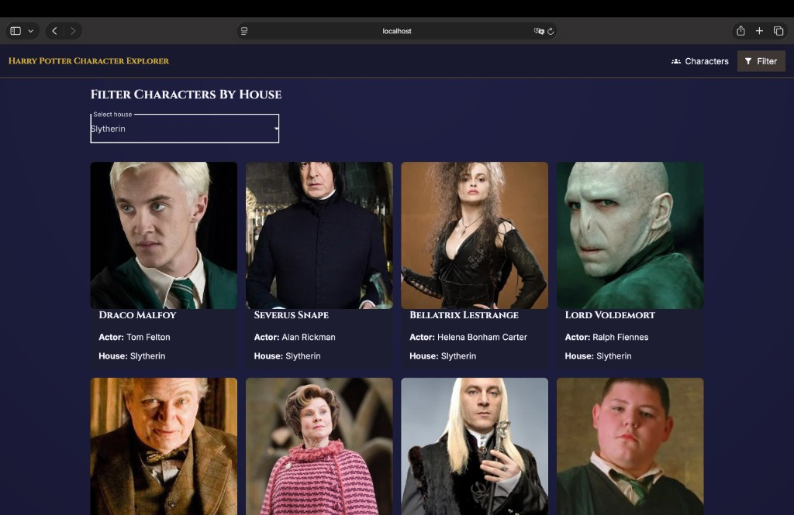
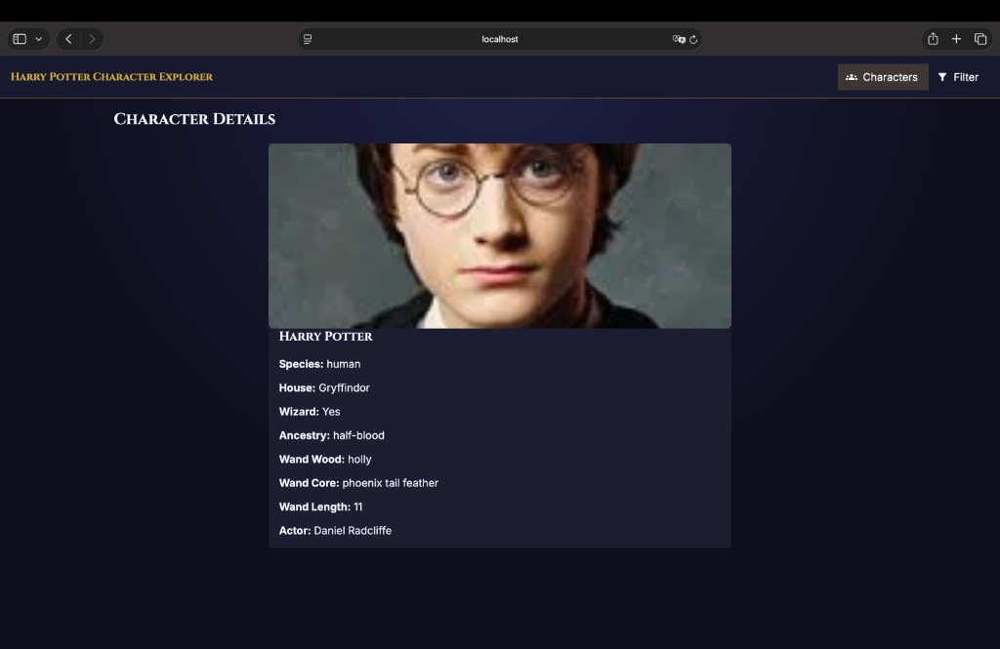

# COMP3133 Lab Test 2b - Harry Potter Theme

## Student Information
- Name: Karina Vetlugina
- Student ID: 101501883

## App Description
This Angular HTTP Client application displays Harry Potter characters using the HP API.  
It includes a character list, house filter, and character details pages with Angular Material UI and modern Angular template syntax.

## Implemented Features
- Character List page (`/characters`) with clickable cards.
- Character Filter page (`/filter`) using house dropdown selection.
- Character Details page (`/characters/:id`) using route parameter.
- API integration via service (`HttpClientModule`) and TypeScript interfaces.
- `@for`, `@if`, `@switch`, and `signal` usage across components/service.
- Graceful fallbacks for missing image/house/wand fields.

## Screenshots
### Character List UI

### House Filter UI

### Character Details UI



## How to run

### On your computer (localhost)
```bash
npm install
npm start
```
Open **http://localhost:4200** in your browser. The dev server reloads when you change the code.

### On the deployed site (Vercel)
**Live app:** [https://101501883-lab-test2-comp3133-jzz5kk9ed.vercel.app](https://101501883-lab-test2-comp3133-jzz5kk9ed.vercel.app)

- Character list: [https://101501883-lab-test2-comp3133-jzz5kk9ed.vercel.app/characters](https://101501883-lab-test2-comp3133-jzz5kk9ed.vercel.app/characters)
- House filter: [https://101501883-lab-test2-comp3133-jzz5kk9ed.vercel.app/filter](https://101501883-lab-test2-comp3133-jzz5kk9ed.vercel.app/filter)
- Character details: `https://101501883-lab-test2-comp3133-jzz5kk9ed.vercel.app/characters/<id>` (replace `<id>` with a character id from the API)